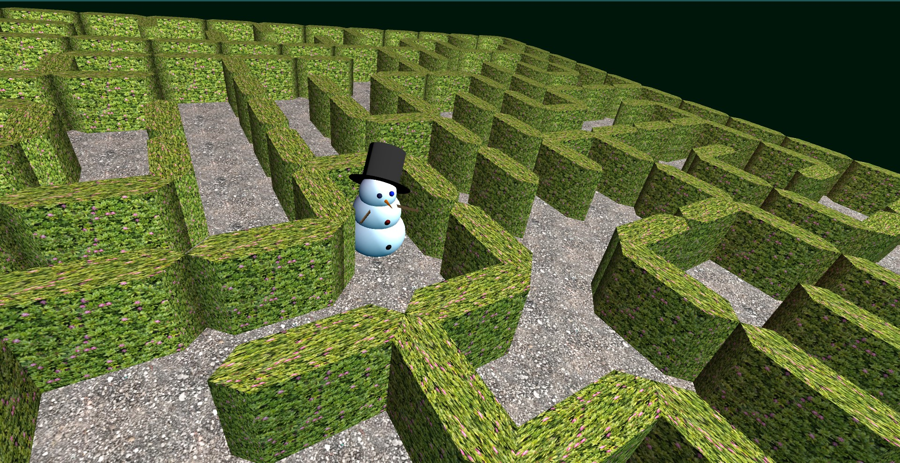
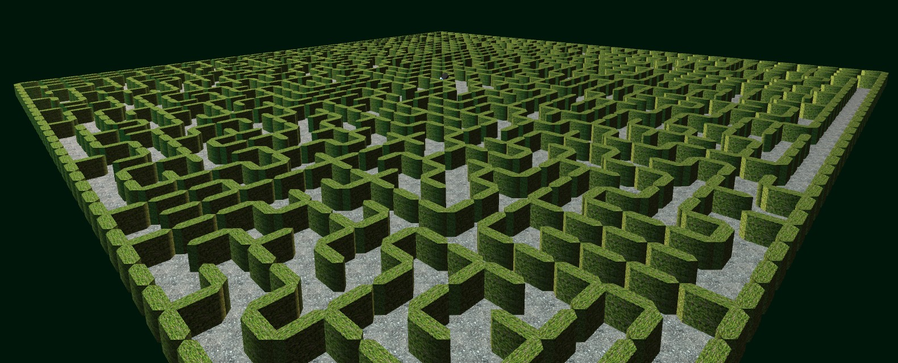

# MazeProcessing

Create random, unique mazes in a 3D world!

 

## What It Does

### Basics

**MazeProcessing** creates a random maze that spans a plane of a certain size.
There will always be one but only one way to reach any point inside the maze from every other point.
You can watch the process unfold as walls are systematically erected in a seemingly erratic manner.
All mazes are created at runtime and will be new every time (as far as randomness allows).

### Viewing the Maze

**MazeProcessing** was built using the [Processing](https://processing.org/) graphics library to show you a 3-dimensional representation of your maze.
With the help of the [PeasyCam](https://github.com/jdf/peasycam) library, you can intuitively drag the camera around and zoom using mouse movement and clicks. 

## How To Use

To use with standard presets, you only need a Java 17 installed on your machine to run the included `tryme.jar`.
To customize presets, change your desired settings in the `config.properties` file (located in `src\main\resources`). You need to have _Processing 3_ and _PeasyCam_ installed to build the project yourself, though.

## Mechanisms behind **MazeProcessing**

The maze is built by sending a randomized "builder" around an empty plane.
It takes single steps in random directions (forwards, left or right).
The builder keeps track of its steps internally. 
Whenever it tries to cross its own path (or walk off the plane), it erects a wall and tries another direction from its current point.  

When a situation is reached where no step can be taken without breaching or erecting a wall, the builder falls back to its previous position. 
From there, it will continue the process of trying random directions, building walls and falling back - until it has fallen all the way back to its starting point.
When no more possibilities are left, the maze is finished.

Through these mechanisms, a random maze is created every time, while making sure that it has no shut-off areas or open spaces.
Each point within the maze can be reached from any other in only and exactly one way.

## Making Of

This project has been created using _Test Driven Development_ for the complete building model - with 100% test coverage (not for the view, though).
The main idea has already been featured in my prior _Python_ prototype [laPYrinth (aka py_labyrinth_maker)](https://github.com/RWitak/py_labyrinth_maker).
There is extensive _JavaDoc_ documentation throughout the module.
